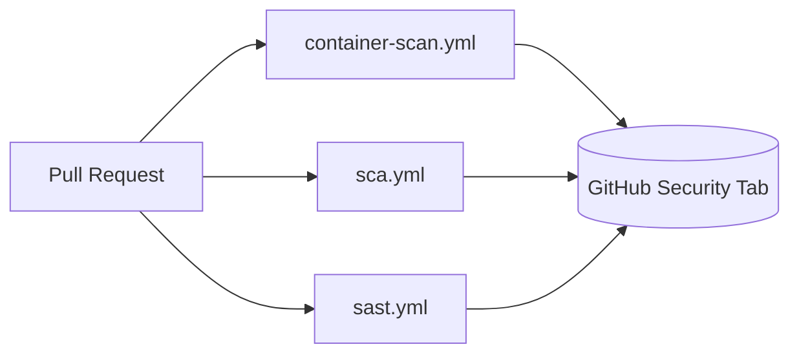

# Application Security Pipelines

Automated security scanning for this service, enforced during Continuous Integration (CI) to block known vulnerabilities and insecure code before merge, automatically on Pull Requests.

Following the OWASP DevSecOps model, scanning is split into three independent pipelines, each with its own workflow, orchestrator script, and gate:

| Pipeline | Workflow | Scans | Tools |
|---|---|---|---|
| **Container Scanning** | `container-scan.yml` | The built Docker image + the Dockerfile | Trivy, OSV-Scanner (image CVEs) . Hadolint, OpenGrep (Dockerfile SAST) |
| **SCA** (Software Composition Analysis) | `sca.yml` | Application dependencies, via SBOM | Trivy, OSV-Scanner |
| **SAST** (Static Application Security Testing) | `sast.yml` | Application source code | OpenGrep |

## Table of Contents

- [1. Repository layout](#1-repository-layout)
- [2. Architecture](#2-architecture)
- [3. Tool installation (`setup-tools.sh`)](#3-tool-installation-setup-toolssh)
- [4. Pipeline: Container Scanning](#4-pipeline-container-scanning)
- [5. Pipeline: Software Composition Analysis (SCA)](#5-pipeline-software-composition-analysis-sca)
- [6. Pipeline: Static Application Security Testing (SAST)](#6-pipeline-static-application-security-testing-sast)
- [7. Gate status reference](#7-gate-status-reference)
- [8. Suppressing a false positive](#8-suppressing-a-false-positive)

## 1. Repository layout

```
.github/
├── workflows/
│   ├── container-scan.yml     # builds the image, scans the Dockerfile (SAST) and image (SCA)
│   ├── sca.yml                 # resolves deps, generates SBOM, scans it (SCA)
│   └── sast.yml                 # scans source code (SAST)
└── scripts/
    ├── setup-tools.sh          # installs trivy, osv-scanner, opengrep, hadolint, semgrep-rules
    ├── container_scan.py       # orchestrator for container-scan.yml
    ├── sca_scan.py               # orchestrator for sca.yml
    ├── sast_scan.py              # orchestrator for sast.yml
    ├── parse_sarif.py            # shared: reads SARIF security-severity scores
    ├── suppress_trivy.yaml       # shared Trivy ignore file
    └── suppress_osv_scanner.toml # shared OSV-Scanner ignore file
```

> **Note:** all three workflows trigger on `pull_request`, `workflow_dispatch`, and a weekly Monday 02:00 UTC schedule, and run independently in parallel. Each has its own gate and its own category in the GitHub Security tab.

## 2. Architecture



All three trigger independently and run in parallel; each uploads its own SARIF category to the Security tab.

---

## 3. Tool installation (`setup-tools.sh`)

```bash
bash .github/scripts/setup-tools.sh --install-tool <tool1,tool2,...|all> [--sbom-ecosystem maven|npm|none]
```

`--install-tool` accepts a comma-separated list (or `all`):

| Tool | Installed from | Used by |
|---|---|---|
| `trivy` | official release tarball, SHA256-pinned | Container Scanning (sca), SCA |
| `osv-scanner` | GitHub release binary, SHA256-pinned | Container Scanning (sca), SCA |
| `opengrep` | GitHub release binary, SHA256-pinned | Container Scanning (sast), SAST |
| `hadolint` | GitHub release binary, SHA256-pinned | Container Scanning (sast) |
| `semgrep-rules` | cloned from `semgrep/semgrep-rules` at a pinned commit | Container Scanning (sast), SAST |

`--sbom-ecosystem npm` generates `target/bom.json` afterward.  `container-scan.yml`, scans the built image directly and needs no SBOM.

All tool versions and SHA256 checksums are pinned at the top of the script (with `# renovate:` markers so Renovate bumps version + checksum together). The script stops and prints the failing line/command on any error rather than continuing silently.

---

## 4. Pipeline: Container Scanning

`container-scan.yml` builds the Docker image once, then runs `container_scan.py` twice against it, once per `--scan-type`:

- **`--scan-type sast`** → runs **Hadolint** and **OpenGrep** against the `Dockerfile` itself (bad practices, missing pinning, insecure instructions).
- **`--scan-type sca`** → runs **Trivy** and **OSV-Scanner** against the *built image* (OS packages, layers).

Both steps run regardless of each other (`if: always()`), all four SARIF files are uploaded individually to the Security tab, then merged into one artifact via `--merge-sarif` for retention.

`container_scan.py` is a single CLI shared by both scan types:

```
$ python3 .github/scripts/container_scan.py --help
usage: sec-orchestrator [-h] [-s {sast,sca}] [-i IMAGE] [--merge-sarif SARIF_FILE [SARIF_FILE ...]] [--merge-output MERGE_OUTPUT]

Agnostic DevSecOps Container scanning Pipeline Orchestrator

options:
  -h, --help            show this help message and exit
  -s, --scan-type {sast,sca}
                        Specify the security methodology to execute (e.g., sast, sca)
  -i, --image IMAGE     Target Docker image reference
  --merge-sarif SARIF_FILE [SARIF_FILE ...]
                        List of SARIF files to merge into one report
  --merge-output MERGE_OUTPUT
                        Output path for the merged SARIF file
```

**Running it locally:**
```bash
docker build -t app:local .
bash .github/scripts/setup-tools.sh --install-tool trivy,osv-scanner,opengrep,hadolint,semgrep-rules
python .github/scripts/container_scan.py --scan-type sast
python .github/scripts/container_scan.py --scan-type sca --image app:local
```

## 5. Pipeline: Software Composition Analysis (SCA)

`sca.yml` scans **application dependencies**, not the container. It installs dependencies, generates an SBOM (CycloneDX), and scans that SBOM with **Trivy** and **OSV-Scanner** via `sca_scan.py`.

Both tools need to be installed first, same as Container Scanning, via `setup-tools.sh --install-tool trivy,osv-scanner`.

**Running it locally:**
```bash
npm ci
bash .github/scripts/setup-tools.sh --install-tool trivy,osv-scanner --sbom-ecosystem npm   # -> npx @cyclonedx/cyclonedx-npm -> target/bom.json
python .github/scripts/sca_scan.py
```

Use `npm ci`, not `npm install`, before generating the SBOM: `npm ci` installs strictly from `package-lock.json`, deletes `node_modules` first for a clean install, and **fails immediately** if `package.json` and `package-lock.json` are out of sync, and it never rewrites the lockfile. If it fails, that's a signal `package-lock.json` is stale and needs to be regenerated locally (`npm install`, then commit the updated lockfile), not something to patch around in the pipeline.

Trivy and OSV-Scanner both run against the SBOM, findings are evaluated by `parse_sarif.evaluate()`, and the two SARIF files are merged into one artifact. This uses the same CVSS-score gate model as the SCA half of Container Scanning.

## 6. Pipeline: Static Application Security Testing (SAST)

`sast.yml` scans **source code** (not the Dockerfile, not dependencies) with **OpenGrep**.

`run_opengrep()` runs twice: once to write the full SARIF report, once as the actual gate, using the same command both times with different flags.

**Running it locally:**
```bash
bash .github/scripts/setup-tools.sh --install-tool opengrep,semgrep-rules
python .github/scripts/sast_scan.py
```

---

## 7. Gate status reference

Two different gate models are in play, depending on whether a tool reports **CVE severity** or **rule severity**:

### CVSS-score gate (SCA tools: Trivy, OSV-Scanner; both container-image and SBOM scans)

`parse_sarif.evaluate()` reads the `security-severity` property of each SARIF result and takes the **highest score across all results**. That single number decides the status:

| Status | Meaning | Blocks the pipeline? |
|---|---|---|
| `PASSED` | Highest score < 5.0 | No |
| `WARNING` | Highest score 5.0 to 7.9 | No (logged only) |
| `FAILED` | Highest score ≥ 8.0 | **Yes** |
| `ERROR` | Tool crashed / SARIF missing | **Yes** |

### Rule-severity gate (SAST tools: OpenGrep, Hadolint)

These tools don't report CVSS. Each tool's own severity threshold (`--severity=ERROR --error` for OpenGrep, `--failure-threshold error` for Hadolint) decides the status directly:

| Status | Meaning | Blocks the pipeline? |
|---|---|---|
| `PASSED` | No error-severity findings | No |
| `FAILED` | Error-severity findings present | **Yes** |
| `ERROR` | Tool did not run correctly | **Yes** |

Both `container_scan.py --scan-type sast` and `sast_scan.py` use this model. `container_scan.py --scan-type sca` and `sca_scan.py` use the CVSS-score model above.

All three pipelines write their findings as SARIF files, which are uploaded to the GitHub Security tab, but they're also plain JSON you can inspect directly. To browse a SARIF file locally without the Security tab (e.g. one downloaded from the workflow artifacts), drop it into a SARIF viewer such as [Microsoft's SARIF Web Component](https://microsoft.github.io/sarif-web-component/).

---

## 8. Suppressing a false positive

Suppression applies to the **CVSS-score tools** (Trivy, OSV-Scanner) and is shared across Container Scanning and SCA, since both point at the same two ignore files.

**Trivy** (`suppress_trivy.yaml`):
```yaml
vulnerabilities:
  - id: CVE-2026-54515
    statement: "The proposed fix version 2.21.5 not yet released"
```

**OSV-Scanner** (`suppress_osv_scanner.toml`):
```toml
[[IgnoredVulns]]
id = "GHSA-5jmj-h7xm-6q6v" # or CVE-2026-54515, GO-2022-0968 ...
ignoreUntil = 2026-09-30
reason = "The proposed fix version 2.21.5 not yet released"
```

Refer to the official docs for complete suppression options:
- **Trivy**: [Filtering and ignore files](https://trivy.dev/docs/latest/configuration/filtering/#trivyignoreyaml)
- **OSV-Scanner**: [Ignore vulnerabilities by ID](https://google.github.io/osv-scanner/configuration/#ignore-vulnerabilities-by-id)

OpenGrep/Hadolint findings (SAST) aren't suppressed through a shared ignore file in this setup; handle those at the rule/finding level instead.